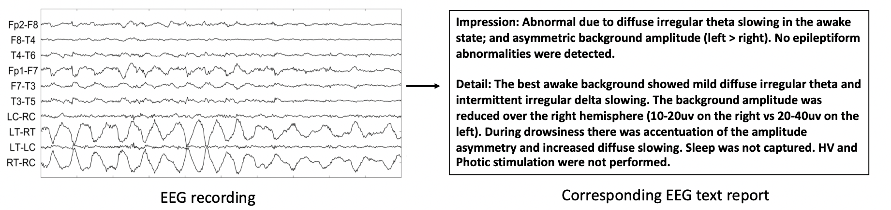
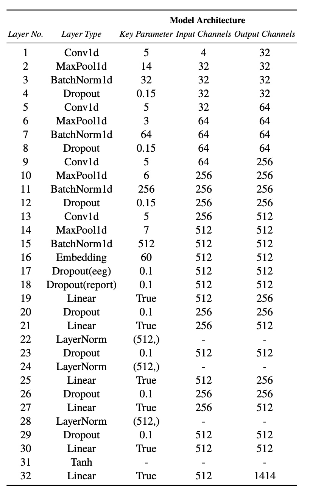

# Medical-Text-Generation-EEG-Transformer

This repo contains Pytorch implementation of CNN+Transformer on medical text generation. Electroencephalogram(EEG)is widely used for medical professionals to identify possible brain disorders. However, manual EEG report creation can be time-consuming and error-prone. To combat these issues, we proposed an automatic approach to generate EEG reports using Transformers. We named our model EEG Transformers, and it consists of three parts: the EEG encoder, the Transformer encoder, and the Transformer decoder. Although our model has not achieved state-of-the-art performance, it still produces promising results. Detailed information can be found on [`report.pdf`](./report.pdf)

# Dataset

The dataset used is [TUH](https://www.isip.piconepress.com/projects/tuh_eeg/html/downloads.shtml) from Temple University[1]. Below is an example of input EEG and output report taken from related paper[2]. Considering relatively large file size, there are only two samples in `Dataset` folder.

# Usage

#### 1. Processing data
`python preprocess.py`

#### 2. Training
`python main.py`

# Experiment

For training hyperparameters, we use learning rate of 0.001, batch size of 32, epoch of 50 and we do evaluation every 10 epochs. We use architecture table below. Layer 1-15 are encoder where we use Conv1d, MaxPool1d and BatchNorm1d where we downsample and normalize the EEG data. Layer 16 is the embedding look up table. Layer 17-18 are positional encoding where we put relative position in text sequence into the layers. Layer 19-24 and layer 25-29 are two Transformer for decoding. layer 30-32 are word-net where we match the output to text.

# Conclusion

We proposed an encoder decoder architecture based Electroencephalogram medical generation model. It takes EEG signal data as input and output the impression and description part of the report. We use traditional stacked CNN and positional encoding for encoder and we use innovative transformer with word-net to be the decoder. The model achieves reasonable performance under METEOR and BLEU measurement considering the size of the training data. In the future we plan to train our model in full dataset and expand its functionality to predict other sections of the report.

# Acknowledgement

Thanks for the help from @Jialong, @Peiyao, @Kaichen and @Beichen.

# Reference
> 1.Obeid, I., & Picone, J. (2016). The Temple University Hospital EEG Data Corpus. Frontiers in neuroscience, 10, 196. https://doi.org/10.3389/fnins.2016.00196

> 2.Biswal,S.,Xiao,C.,Westover,M.B.&Sun,J..(2019).EEGtoText:LearningtoWriteMedicalReportsfromEEGRecordings. Proceedings of the 4th Machine Learning for Healthcare Conference, in PMLR 106:513-531.
